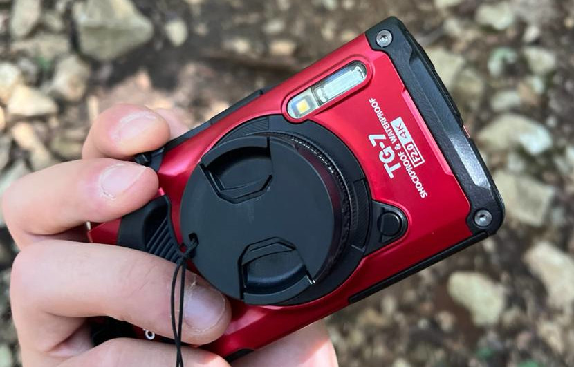

It has been a while since I set up this blog but I didn't post anything.  Let's
say I had the best intentions but the worst ideas to post on it.  I was
struggling to contemplate this empty canvas without understanding the real
issue: I first had to do something to be able to write about it.  I left the
space blank for a long time but then I realized I needed a hobby or any
experience to share and save permanently both on the blog and in my brain.

The previous week leading to the holiday everything came together, and my mind
was finally clear.  I took the chance of the upcoming holiday to seriously pick
up one of the passions that bugged me constantly for some years **photography**.
I tried a bunch of times in the past and I always got stuck on the same thing:
I'm clumsy and (usually) cameras aren't the most rugged devices around.

I started doing some research on the internet looking for a solution and this
jewel popped up in the results.
This clever creation is as rugged as it can be, while still delivering good
enough pictures.  The only delicate part about it is the lenses!

On paper, everything seemed perfect for me, but I was still ignoring another big
issue: I have the same tremors as an angry chihuahua.  At this point, I was too
committed to the cause, and my Amazon order had already been placed :D I started
studying digital photography theory more, and while reading a post on Reddit, a
kind folk gave me the answer!  Let's just shoot on a higher ISO and lower
shutter speed, all while taking hundreds of pictures.  It might not be
beautiful, but in 100 1 milliseconds tries, my hands will be steady at least
once, and if not, let's move to the next subject.

Since the holiday was at sea I just added a polarized filter and with some
repurposed SD cards, and a couple of extra batteries I was ready for battle!  Just
because I like traveling light I also brought a laptop with me to learn how to
use Darktable... I had to go all out, shoot raw, and do my post-processing with one of the hardest software around.
**We're tryhards after all.**

This short experience taught me that struggling with something it's never a valid
excuse to quit, and if something is really meaningful to you, just putting in the
effort to make it work is worth the journey.  I hope this camera will last so
long that I'll be the "Back in my days" guy still rocking his old machinery.
And I'll try to improve my skills so that investing the money for all the
equipment will be worth it.  In the meantime, you can see some pictures I took on
the right side.  That's all for this blog post, and see you in the next one!

*Side note:*
My meme brain started seeing people who take pictures with smartphones in the
same way as the ones who add "Sent from my iPhone" as their email footer.
